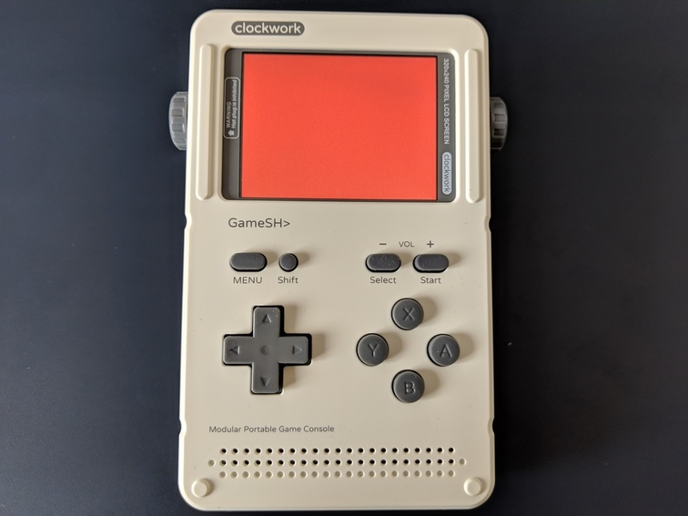

# GameShell Cross Compiling



### [crosstool-NG](http://crosstool-ng.github.io/)

Simply follow the instructions on how to set up a toolchain from their Documentation page (pages 1-4). If you’re unsure about how to configure crosstool-ng, you can use my configuration available [here](https://gist.github.com/Ruenzuo/04b9daddb946583ed289e0fa0e9c190f). Some useful bits:

* GameShell machine name is `arm-linux-gnueabihf`
* Target OS is `linux`
* Version is `4.20.8` (based on clockworkOS image 0.3)
* glibc version is `2.24`

### SDL2

Once you have a cross compile toolchain (building takes a while), you’re ready to cross compile SDL2. Get the source code and run the following for the configuration and installation:

```bash
$ ./configure --host=armv7l-unknown-linux-gnueabihf --build=x86_64-linux-gnu --disable-pulseaudio --prefix=/usr
$ make
$ make DESTDIR=~/x-tools/armv7l-unknown-linux-gnueabihf/armv7l-unknown-linux-gnueabihf/sysroot install
```
